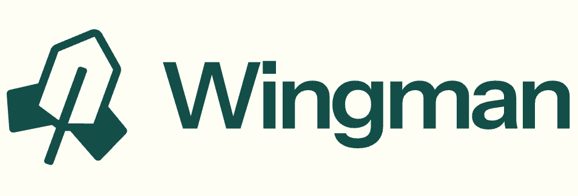
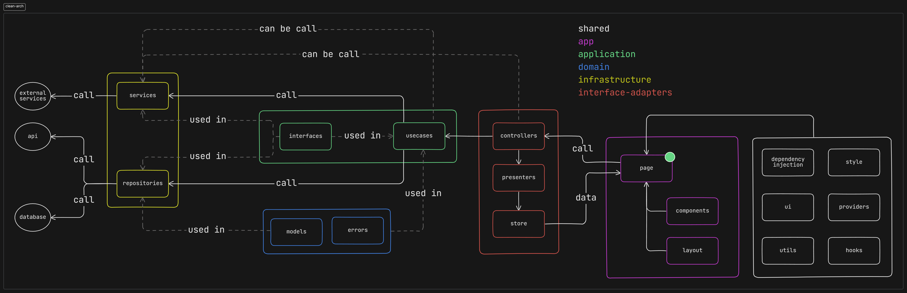
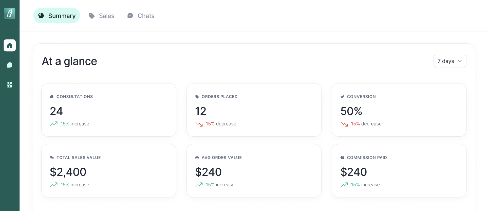
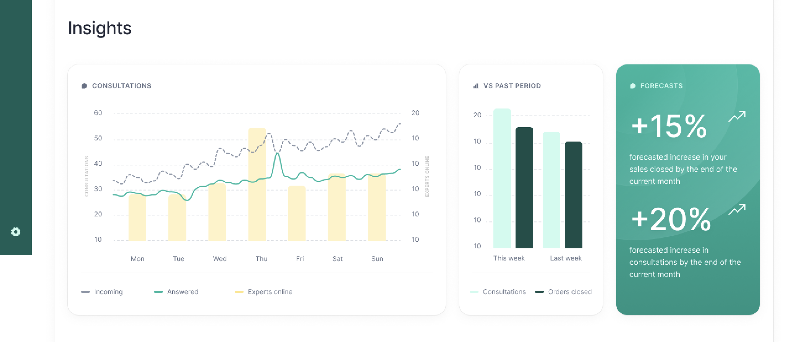
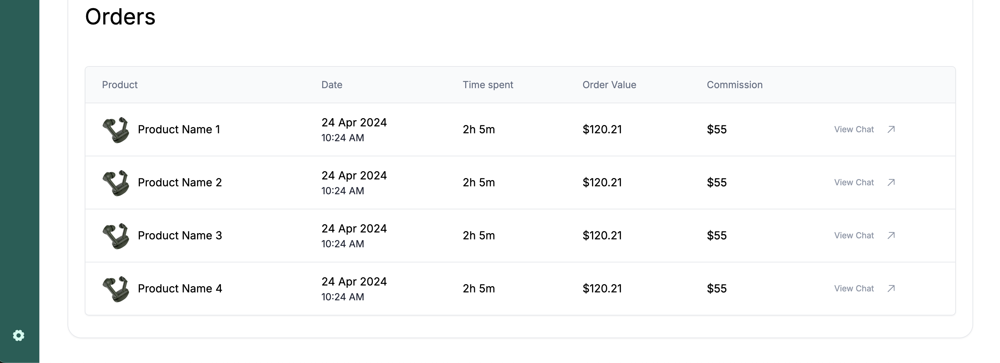

<a href="https://github.com/mvmmarcus/wingman-store-dashboard-dashboard">
    
  <h1 align="center">Wingman Store Dashboard</h1>
</a>

<p align="center">
  Project implemented with clean architecture with NextJs
</p>

<div align="center">
  
  
  
  
  
  
  
  
  
  
  
</div>
<br/>

<br/>

## How to install

```bash
  # Clone the project
  git clone https://github.com/mvmmarcus/wingman-store-dashboard/

  # Go to the project directory
  cd wingman-store-dashboard

  # Install dependencies
  npm install

  # Start the server
  npm run dev
```

## Data

Hard coded data was used to simulate api call

## About Clean Architecture

Software design principle focused on organizing the code to improve maintainability, testability, and flexibility by clearly defining the responsibilities of different components. When applied to an application using the GitHub API, it ensures that the core business logic remains independent of external systems like the API.

This allows for easier updates, testing, and modifications, as changes to the API or other external dependencies do not directly impact the core logic. The approach promotes a modular and extensible design, making the application easier to maintain and scale over time.

## Layers and Structs

Following the Clean Architecture principles, we separate our project into 4 layers inside the [layers](./src/layers/) folder:

| Name                                                   | Contains                                                                                                    | Purpose                                                                                                                                                                                                                                                           |
| ------------------------------------------------------ | ----------------------------------------------------------------------------------------------------------- | ----------------------------------------------------------------------------------------------------------------------------------------------------------------------------------------------------------------------------------------------------------------- |
| [interface-adapters](./src/layers/interface-adapters/) | [controllers](./src/layers/interface-adapters/controllers)                                                  | The layer translates data between the core business logic and the UIs. It implements controllers to adapt data returned by the usecases into usable formats.                                                                                                      |
| [application](./src/layers/application/)               | [interfaces](./src/layers/application/interfaces) & [usecases](./src/layers/application/usecases)           | Contains the usecases that define the application's business processes and workflows. Usecases may also need data from external sources, so they interact with repositories or services implemented in the infrastructure layer to fulfill specific requirements. |
| [infrastructure](./src/layers/infrastructure/)         | [repositories](./src/layers/infrastructure/repositories) & [services](./src/layers/infrastructure/services) | The layer provides the implementation details for external systems like databases, APIs, and file storage. It's responsible for managing communication with external services and ensuring the core logic remains decoupled from specific technologies.           |
| [domain](./src/layers/domain/)                         | [errors](./src/layers/domain/errors) & [models](./src/layers/domain/models)                                 | Contains models, schemas and errors that drive the system's behavior.                                                                                                                                                                                             |

You can explore the entire data search process, layer by layer, through the graph below:

<a href="https://github.com/mvmmarcus/wingman-store-dashboard/blob/main/public/clean-arch.png">
  
</a>

## Overhead Structure View

- [src](./src/)
  - [app](./src/app/)
    - [\_components](./src/app/_components)
  - [layers](./src/layers/)
    - [application](./src/layers/application/)
      - [interfaces](./src/layers/application/interfaces)
      - [usecases](./src/layers/application/usecases)
    - [domain](./src/layers/domain/)
      - [errors](./src/layers/domain/errors)
      - [models](./src/layers/domain/models)
    - [infrastructure](./src/layers/infrastructure/)
      - [repositories](./src/layers/infrastructure/repositories)
      - [services](./src/layers/infrastructure/services)
    - [interface-adapters](./src/layers/interface-adapters/)
      - [controllers](./src/layers/interface-adapters/controllers)
  - [shared](./src/shared/)
    - [di](./src/shared/di/) - (using [ioctopus](https://github.com/Evyweb/ioctopus) as dependency injection)
    - [hooks](./src/shared/hooks/)
    - [providers](./src/shared/providers/)
    - [ui](./src/shared/ui/)
    - [utils](./src/shared/utils/)
  - [tests](./src/tests/)

## Framework and Packages

- [Next.js](https://nextjs.org/)
- [TypeScript](https://www.typescriptlang.org/)
- [Prettier](https://prettier.io/)
- [ESLint](https://eslint.org/)
- [Shadcn/UI](https://ui.shadcn.com/)
- [Tailwind CSS](https://tailwindcss.com/)
- [Framer Motion](https://framer.com/motion)
- [Zod](https://zod.dev/)
- [Vitest](https://vitest.dev/)
- [ioctopus](https://github.com/Evyweb/ioctopus)

# Screenshoots

|                                  |                                  |
| -------------------------------- | -------------------------------- |
|  |  |
|  |                                  |

## License

MIT License. [LICENSE](./LICENSE)

## Author

Marcus Marques ([@mvmmarcus](https://github.com/mvmmarcus))
